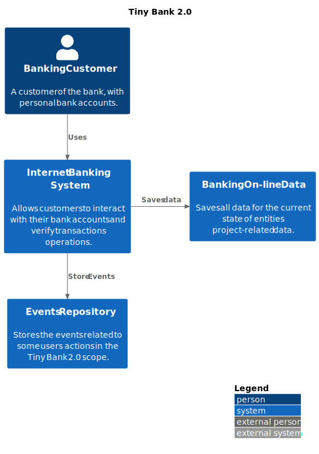

# Tiny Bank 2.0

This small documents session aims to state the documentation needed to make clear the approach used for the Tiny 
Bank 2.0 in terms of design and decisions. To reach the goal to simplify the project documentation it was chosen as a 
design approach the usage of C4-Model diagrams. This decision was taken since C4-Model diagrams have a less strict 
rules' notation. It can simplify reading and communication with a broader audience.

Since the requirements asked to keep it simple and suggest you to use something like a dictionary or a map or a similar 
data structure, and not a full-fledged database, all the aspects that comes for free with a full-fledged database were 
left behind. It will be used Map structures to represent objects relationships, or events (this decision will be 
explained in details later). The implementation didn't cover those responsibilities because they come for free even with 
an in-memory database (like h2 or a MongoDB in-memory solution).

Also into this direction it is not going to be handled login and user access control issues. This can bring a complexity 
level that increase the complexity of a simple api service sample. In a first moment, concurrence aspects were not taken 
into consideration. If this scenario should be solved, services with centralized access and concurrence controls would be 
chosen to solve this issue. Or in case of a needed scenario, some specific implementation using thread-safe solutions.

## System Context

This context represents the idea of the application as a whole.

