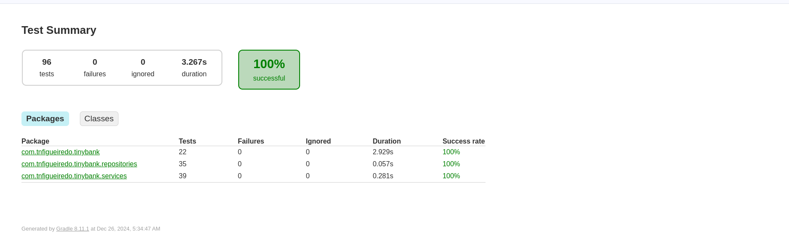
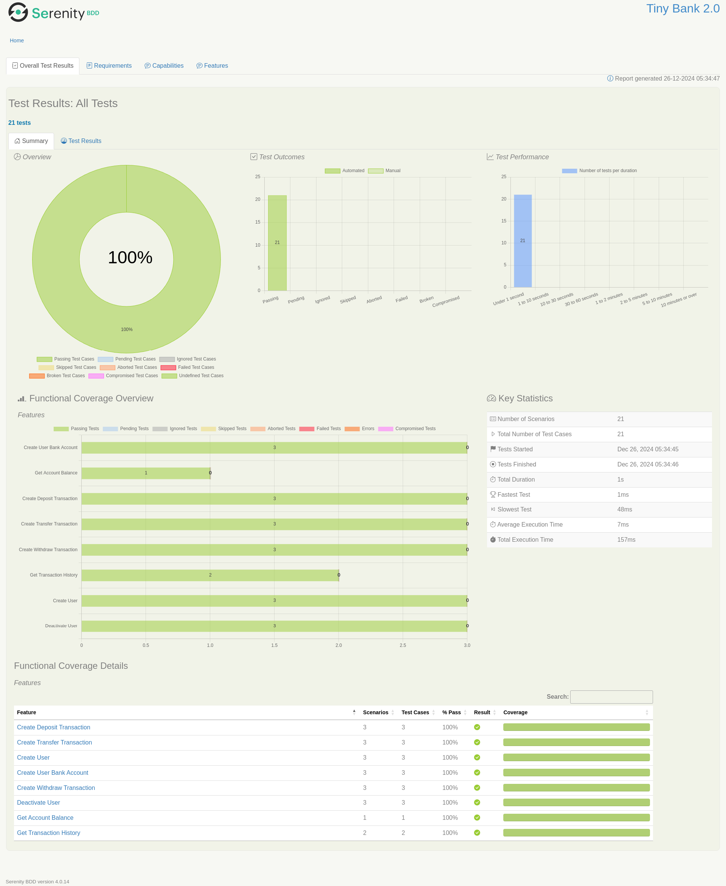
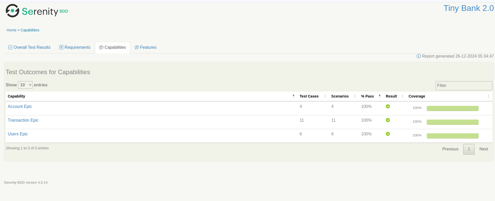
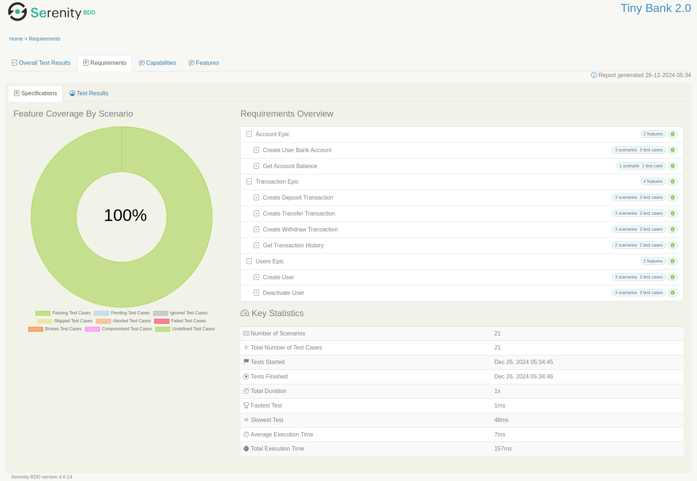
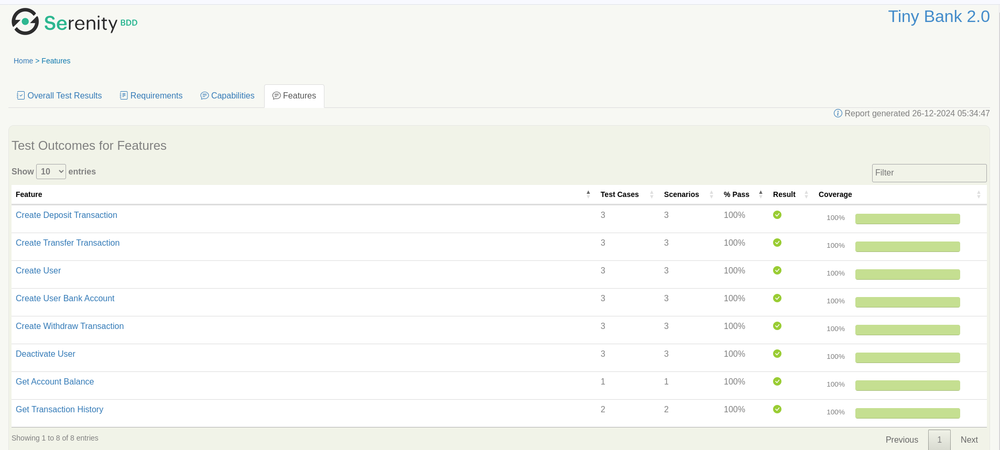
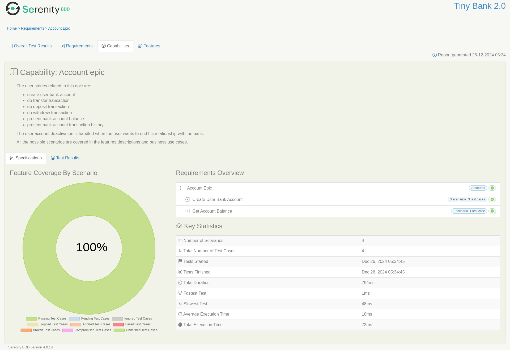
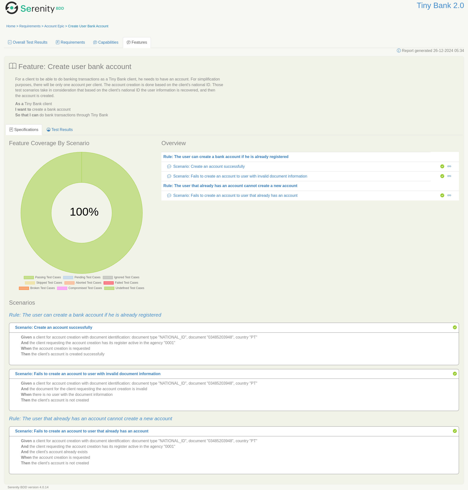
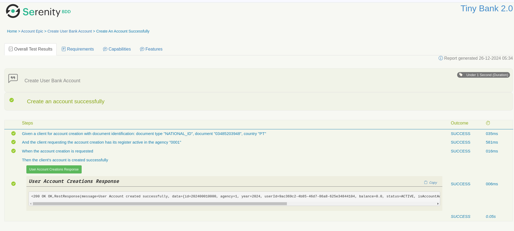

# Test Documentation

The idea of providing test documentation was to make it clear how requirements and validations were designed. They are a 
complement to the decisions registered in the ADRs. The tests are written in a way that they can be used as a reference to 
guide even the refactoring process. Since there was a huge effort on that, it is clear that it can have some impact in the 
refactoring dynamics proposed to be done. If it is necessary, they can be ignored while in this process.

## Unit Tests Data

The unit tests data was generated through the standard build process handled by Gradle. They are exported to the docker 
service unitTestDocs, and they can be accessed through the address http://localhost:8082/index.html once the docker compose 
services stack is up and running.

## BDD Tests Data

The Serenity BDD tests data is a little bit more complex to explain, but they are not so hard to navigate through. It has its 
own concepts that can be translated to an Agile approach. To avoid expend more time with reports customisations it seems 
better to explain how to translate its concepts to the Agile world. Once the docker stack is running they can be 
accessed through the address http://localhost:8081/index.html

### Home report session

The home report page brings a summary of the test cases and their results. It is possible to see all the features and the 
test cases results summary. It brings a high level vision related to the features validated. It a feature is chosen to check 
the details, it is possible to see the details of its validated scenarios.

### Capabilities/Epic session

This session brings a list of the epics handled in the projects. This summary vision is an entry point for the epics' 
documentation.

### Requirements session

This session brings a summary of the requirements (in the project approach, user stories) handled in the project scope. 
It brings a view about each of the epics with its requirements and highlight details about the test cases execution.

### Features session

This session is a summary about the project's requirements/user stories. It allows to access directly the scope of 
business and validations done to a specific feature.

### Capability/Epic description

This session brings a detail about the subject scope being handled by a set of stories. There are some high leve information 
about the business scope of the epic.

### Feature/User Story

Into the feature documentation session it is possible to find the User Story and its scenarios' validation summary. This 
allows to have a highlight over the acceptance criteria being validated for the specific user story.

### Acceptance criteria

When selecting an acceptance criteria, it is possible to check the data handled and validated in the business case scenario. 
It is also possible to check details on the data handled on it.

